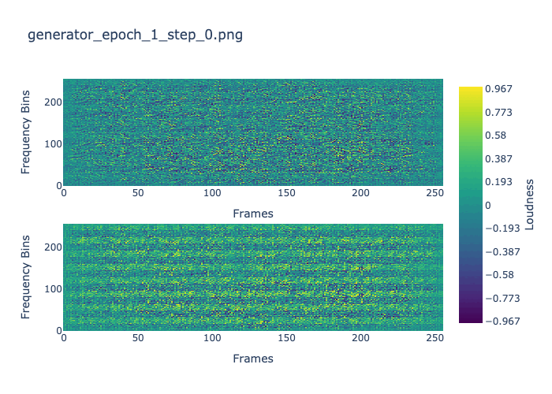

# StereoSampleGAN

StereoSampleGAN: A lightweight approach high fidelity stereo audio sample generation.

## Model Usage

### 1. Prereqs

- Optional but highly reccomended: Set up a [Python virtual environment.](https://www.youtube.com/watch?v=e5GL1obY_sI)
  - Audio loader package `librosa` requires an outdated version of Numpy
- Install requirements by running `pip3 install -r requirements.txt`

### 2. Generate audio from pretrained models

Specify sample count to generate, output, etc `usage_params.py`

- Generate audio from the Curated Kick model by running `python3 src/run_pretrained/generate_curated_kick.py`
- Generate audio from the Diverse Kick model by running `python3 src/run_pretrained/generate_diverse_kick.py`
- Generate audio from the One Shot model by running `python3 src/run_pretrained/generate_one_shot.py`

### 3. Train model

Specify training data paramaters in `usage_params.py`

- I reccomend anywhere between 4,000-8000 training examples, any multiple of 8 and audio
  <1 sec long (longer hasn't been fully tested)
- Prepare training data by running `python3 src/data_processing/encode_audio_data.py`
- Train model by running `python3 src/stereo_sample_gan.py`
- Generate audio (based on current `usage_params.py`) by running `python3 src/generate.py`

Training progress visualization (Diverse Kick Drum Model):

## Pretrained Models

### Diverse Kick Drum

Kick drum generation model trained on ~8000 essentially random kick drums.

- More variation between each generated sample but audio is often inconsistent and contains some artifacts.

### Curated Kick Drum

Kick drum generation model trained on ~4400 slightly more rigorously but still essentially randomly chosen kick drums.

- Less variation between each drum sample's tone but also closer to a "normal" kick drum sound. Still noisy and sometimes but more infrequently noisy.

### Instrument One Shot

- Instrument one shot generation model, trained on ~3000 semi-curated instrument one shots.
- WIP
- `model_save_name="StereoSampleGAN-InstrumentOneShot`
- WIP

## Directories

- `outputs`: Trained model and generated audio
- `paper`: Research paper / model writeup
- `static`: Static images and gifs
- `src`: Model source code
  - `utils`: Model and data utilities
  - `data_processing`: Training data processing scripts
