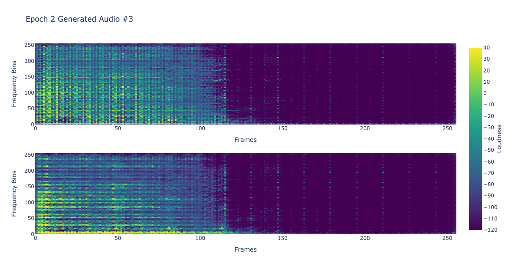

# StereoSampleGAN (WIP)

StereoSampleGAN: A lightweight approach high fidelity stereo audio sample generation. Generate a kick drum by running `generate.py`.

Generated audio spectrogram examples:

## Directories

- `paper`: Research paper and static images
- `model`: Trained model and generated audio
- `src`: Model source code
  - `utils`: Model and data utilities
