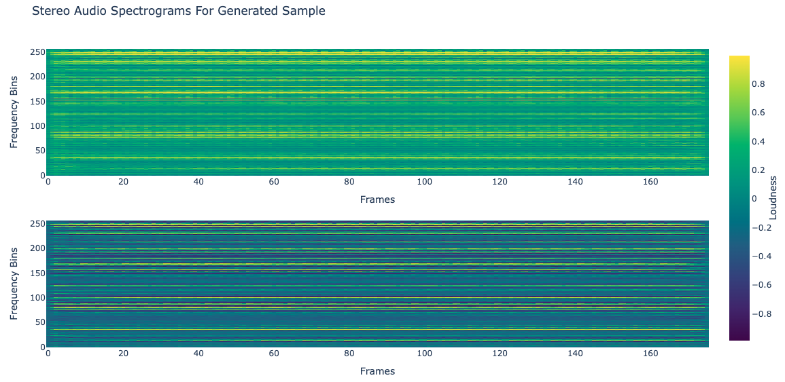

# Kick it Out: Limitations to Two Channel Audio Generation With a Deep Convolution Generative Network

#todo: after written, rewrite everything with like the better clearer idea of like bigger differences of what is happening here that's more novel and new result or whatever- like the two channell gen not happening whereas specgan 1 channel works or whatever like figure out better whast novel here and whatever THEN can send it out to whoever whaytever

Abhay Shukla\
abhayshuklavtr@gmail.com\
Continuation of UCLA COSMOS 2024 Research

## Abstract

\_\_\_GENERATE ALL IMAGES NEWLY BC NEW STUFF OR WTV JST LIKE ALL IMAGES USED DONT GO OFF OLD IMAGES JUST GEENRATE EVERYTHING MYSELF
\_\_\_ALSO TRY CHANING ARCHITECURE TO BE 8 LAYERS AND HAVE OUTPUT 256,256 BEFORE UPSCALE

## Introduction

Since their introduction, CNN based Generative Adversarial Networks (DCGANs) have vastly increased the capabilites of machine learning models, allowing high-fidelity synthetic image generation [1]. Despite these capabilities, audio generation is a more complicated problem for DCGANs. High quality audio generation models must be able to capture and replicate sophisticated temporal relationships and spectral characteristcs, in a consistent manner. Accounting for audio data's complexities requires advanced training techniques and/or a network architecture tailored towards audio, yet this work attempts to represent audio data as images and recognize the limitations of audio representation generation using a Deep Convolutional Generative Network that does not use advanced training techniques and specialized audio-specific network architectures.

Considerations for sounds to generate were kick drums, snare drums, full drum loops, and synth impules. This work attempts to generate kick drums because they best met the criteria of containing some temporal patterns but also not being too complex of a sound and also being a quick impulse. Kick drums are simple sounds that have the potential to have some, but not an infinite amount of possible variance. Kick drums are also an integral part of digital audio production and the foundational element of almost every song and drumset. Due to their importance, finding a large quantity of high quality, unique kick drum samples is often a problem in the digital audio production enviroment.

This investigation primarily seeks to determine how feasible it can be to use purely a DCGAN Architecture to recognize and replicate the spatial patterns and temporal patterns of an image representation of a kick drum. We will also experiment with generating pure sine waves as a means of validation.

An important distinction is that this network aims to treat spectrograms truly as images, without tailoring the model towards audio generation as established DCGAN audio generation models such as WaveGAN[2] do. SpecGAN[2] follows a more conventional DCGAN approach as this paper aims to do, but key differences between SpecGAN and this work are that this work uses basic convolutions, a deeper architecture, a simpler loss function not accounting for stft loss, and spectral normalization- producing a model closer to a "pure" DCGAN approach. This project also specifically aims to generate stero channel kick drum clips, instead of mono varied percussion and natural sounds as previous models have set out to do.

## Data Manipulation

### Collection

Training data is first sourced from digital production “sample packs” compiled by various parties. These packs contain a variety of kick drum samples (analog, cinematic, beatbox, heavy, edm, etc), providing a wholstic selection of samples that for the most part include a set of "defining characteristics" of a kick drum. The goal of this model is to replicate the following characteristics of a kick drum:

[graphic of kick drum spectrogram]

- A specific length of an audio sample (500 ms)
- An atonal transient “click” at the beginning of the generated audio incorporating most of the frequency spectrum
- A sustained, decaying low "rumble" following the transient of the sample
- An overall "decaying" nature

### Feature Extraction/Encoding

The training data used is a compilation of 7856 audio samples. A simple DCGAN can not learn about the time-series component of audio, so this feature extraction process must to flatten the time-series component into a static form of data. This is achieved by representing audio in the time-frequency domain. Each sample is normalized to a length of 500 miliseconds and passed into a Short-time Fourier Transform with a window of 512 and hop size of 128, returning a representation of audio as an array of amplitudes for 2 channels, 176 frames of audio, 257 frequency bins. This shape is partially determined by hardware contraints.

While amplitude data is important, this data is by nature skewed towards lower frequencies which contain more intensity. To mitigate the effect this has on training, a process of feature extraction occurs to eqalize the representation of frequencies in data. First, after extracting channel amplitudes, the tensor of data is scaled to be between 0 and 100. The data is then passed through a noise threshold where all values under 10e-10 are set to zero. This normalized, noise gated amplitude information is then converted into a logarithmic, decibal scale, which describes percieved loudness instead of intensity, displaying audio information in a more uniform way relative to the entire frequency spectrum. This data is then finally scaled to be between -1 and 1, representative of the output the model creates using the hyperbolic tangent activation function.

[show amp data and loudness spectrograms]

Generated audio representaions are a tensor of the same shape with values between -1 and 1. This data is scaled to be between -120 and 40, then passed into an exponential function converting the data back to "amplitudes" and finally noise gated. This amplitude information is then passed into a griffin-lim phase reconstruction algorithm[3] and finally converted to playable audio.

## Implementation

The model itself is is a standard DCGAN model[1] with two slight modifcations, upsampling and phase shuffling. The Generator takes in 100 latent dimensions and passes it into 9 convolution transpose blocks, each consisting of a convolution transpose layer, batch normalization layer, and ReLU activation. After convolving, the Generator upsamples the output from a two channel 256 by 256 output to to a two channel output of frames by frequency bins and applies a hyperbolic tangent activation function. The Discriminator upscales audio from frames by frequency bins to 256 by 256 to then pass through 9 convolution blocks, each consisting of a convolution layer with spectral normalization, batch normalization layer, leaky ReLU activation, and phase shuffle layer. After convolution, the probability of an audio clip audio being real is returned using a sigmoid function.

This work uses 80% of the dataset as training data and 20% as validation with all data split into batches of 8. The loss function is Binary Cross Entropy with Logit Loss and both the generator and discriminator use the Adam optimizer with seperate learning rates. Due to hardware limitations, the model is trained over ten epochs. Validation occurs every 5 epochs and label smoothing is also applied.

## Results

### Kick Drum Generation

In mostly every training loop, generator and discriminator loss always tends to flatline around epoch 3-5, followedby discriminator loss either also flatlining or marinally reducing. Validation loss also consistently remains around the same amount or increases.

When analyzing generated audio, the model appears to learning to create long horizontal lines spanning the entire sample. Each generated output also appears contain little to no differences between each other. The model fails in learning both the spatial and temporal patterns that any kick drum contains.

While natural/virtual images contain overarching patterns, audio data is usualy more periodic, thus the generator is able to learn to generate random lines and the discriminator believes it to be kick drums.

[show learned kernels]

audio waveforms very periodic, need to do something so it doesnt learn to just generate fake lines

### Sine Validation

Another interesting note is how the model acts when given data of a pure sine wave to generate.

talk abt sine validation, also how even halving data to only be middle freq still gives random lines at top end

## Discussion

### Model Shortcomings

### iSTFT Shortcomings

### Contributions

## Conclusion

also talk abt how transformer based audio gen is happening, audio gen process being made
find somewhere to be like oh wavegan uses direct audio and also

## References

<a id="1">[1]</a> CNN based GAN
https://arxiv.org/abs/1511.06434

<a id="2">[2]</a> GAN audio generation (WaveGAN)
https://arxiv.org/abs/1802.04208

<a id="3">[3]</a> Griffin Lim
https://speechprocessingbook.aalto.fi/Modelling/griffinlim.html

\_\_\_similar result to me
https://openaccess.thecvf.com/content_CVPR_2020/papers/Durall_Watch_Your_Up-Convolution_CNN_Based_Generative_Deep_Neural_Networks_Are_CVPR_2020_paper.pdf

STRUCTURE OF A PAPER (claude generated)

1. title: done
2. Abstract: A brief summary of your paper, including the problem, methods, key results, and conclusions.
3. Introduction: Present the research problem, its importance, and your objectives.
4. Background/Literature Review: Provide context on deep convolution and its applications in audio generation. Review relevant previous work.
5. Methodology: Describe your approach, including:

- Neural network architecture
- Dataset description
- Training process
- Evaluation metrics

6. Results: Present your findings, including:

- Performance metrics
- Audio samples (if possible)
- Comparisons with other methods

7. Discussion: Interpret your results, discuss limitations, and suggest future work.
8. Conclusion: Summarize your key findings and their implications.
9. References: List all sources cited in your paper.
