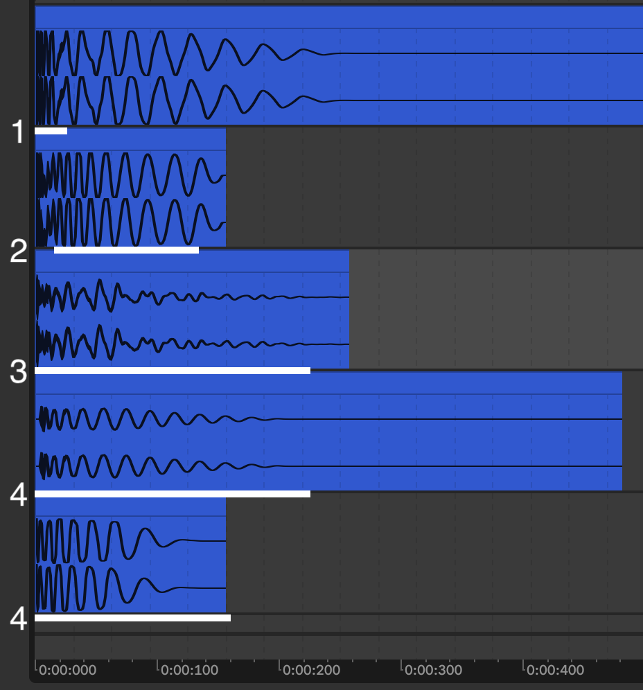

# Kick it Out: Multi-Channel Convolutional Kick Drum Generation

Abhay Shukla\
abhayshuklavtr@gmail.com\
Continuation of UCLA COSMOS 2024 Research

## Abstract

/ write this

## Introduction

Audio generation is an incredibly complex and computationally expensive task, and as architectures develop to efficiently process audio data, current audio generation models tend to reduce the sophistication of data, simplifying multi-channel signals into monophonic audio and reducing audio quality. These simplifications make audio data easier to process but trade off audio quality. While this work does not seek to generate audio indisginguisable from reality, it presents a unqiue approach to generating stero audio.

Audio generation models commonly take advantage of time-series optimized architectures (transformers, recurrent architectures, and HMMs [ADD CITATIONS FOR THIS- MAYBE JUST STH SAYING RECURRENT USED FOR AUDIO]), but this work instead opts to use a Deep Convolutional GAN (DCGAN) Architecture[1] and analyze how effectively it can be used to capture and replicate audio's sophisticated temporal and spectral relationships using multi channel image representations.

As a standard example, this model will focuses on generating a category of audio in an attempt to tailor the model towards the one type of sound and wholicsticly learn it's charactertics. Kick drums were chosen because of their simplicity and constrained amount of variance (see defining characteristics section [make it like a number section code].) Alternate audio category considerations were snare drums, full drum loops, and insrtrument impulses, but kick drums were decided to be the most optimal for this initial experiment due to their simple and relatively consistent features.

## Data Manipulation

### Collection

The training data used is a compilation of 7856 kick drum impules. This data is primarily sourced from digital production “sample packs” which contain various kick drum samples with many different characters and use cases (analog, electronic, pop, hip-hop, beatbox, heavy, punchy, etc), overall providing a diverse range of potential drum sounds to generate that for the most part include the following set of "defining" kick drum characteristics, features we will later try to reproduce where training data variety will be beneficial.

A kick drum's "defining" characteristics include:

1. A transient: The “click” at the beginning of the generated audio incorporating most of the frequency spectrum
2. A fundamental: The sustained, decaying low frequency "rumble" after the transient
3. An overall "decaying" nature (spectral centroid shifts downwards)
4. Ample variability between decay times for each sample

<b>Fig 1:</b> <i>Visualization of key features of a kick drum.</i>

### Feature Extraction/Encoding

Convolution by nature can not learn about the time-series component of audio, so this feature extraction process must to flatten the time-series component into a static form of data. This is achieved by representing audio in the time-frequency domain. Each sample is first converted into a two channel array using a standard 44100 hz sampling rate. Then the audio sample is normalized to a length of 700 miliseconds and passed into a Short-time Fourier Transform (STFT). The STFT uses a kaiser window with a beta value of 14, a window size of of 512, and a hope size of 128. These parameters were determined to be the most effective through a signal reconstruction test (see STFT and iSTFT validation) and also limited by hardware contraints. The data tensor's final shape is 2 channels by 245 frames by 257 frequency bins. This information can be compared to that of a spectrogram.

While amplitude data (the output of the STFT) is important, this data is by nature skewed towards lower frequencies which contain higher intensities. To equalize the representation of frequencies in data the tensor of amplitude data is normalized to be in the range of 0 to 100 and then scaled into the logarithmic, decibal scale, which represents audio information as loudness, a more uniform scale relative to the entire frequency spectrum. The 0-100 scaling is to ensure consistent loudness information. A loudness threshold then sets all signals less than -90 decibals (auditory cutoff for the human ear) to be the minimum decibal value (a constant of -120) this data is then finally scaled to be between -1 and 1, representative of the output the model creates using the hyperbolic tangent activation function.

<b>Fig 2:</b> <i>STFT audio information before and after feature extraction.</i>

Generated audio representations apply the same audio scaling in the opposite direction. The audio is also reconstreucted utilizing a inverse STFT in conjunction with the griffin-lim phase reconstruction algorithm[3]. This entire process preserves most, but not all audio information- a potential pitfall of this method (see STFT and iSTFT Validation)

## Implementation

### Architecture

This model seeks to replicate a DCGAN's multi-channel image generation capabilities[1] to create varied two channel audio representations.

### Training

This work uses 80% of the dataset as training data and 20% as validation with all data split into batches of 16.

## Results and Discussion

### Model Evaluation

what failed, what worked, do other papers have similar results?

talk about generating specifically a kick drum vs learning the general shape of a kick drum/how to replicate a general shape rather than learning oh transiewnt then fundamental etc

[show learned kernels as a part of this]

maybe similar result??
(https://openaccess.thecvf.com/content_CVPR_2020/papers/Durall_Watch_Your_Up-Convolution_CNN_Based_Generative_Deep_Neural_Networks_Are_CVPR_2020_paper.pdf)

### STFT and iSTFT Validation

explain signal reconstruction test + findings

isnt a problem with stft, imrpoving the implementation just hard for me

potential reason for model being so bad: stft istft hella lossy.

### Sine Validation

Another interesting note is how the model acts when given data of a pure sine wave to generate.

talk abt sine validation, also how even halving data to only be middle freq still gives random lines at top end

### Contributions

overall learned info from this research:

## Conclusion

## References

<a id="1">[1]</a> CNN based GAN
https://arxiv.org/abs/1511.06434

<a id="2">[2]</a> GAN audio generation (WaveGAN)
https://arxiv.org/abs/1802.04208

<a id="3">[3]</a> Griffin Lim
https://speechprocessingbook.aalto.fi/Modelling/griffinlim.html
