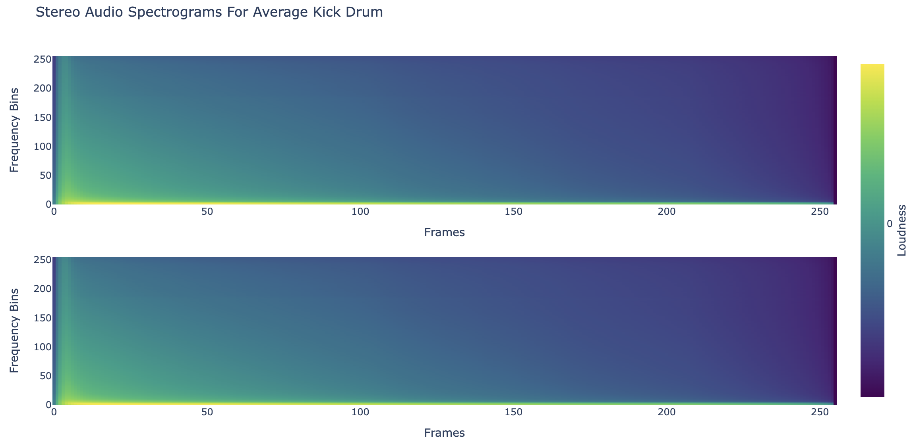

# Kick it Out: Multi-Channel Kick Drum Generation With a Deep Convolution Generative Architecture.

Abhay Shukla\
abhayshuklavtr@gmail.com\
Continuation of UCLA COSMOS 2024 Research

ADD CAPTIONS AND IMAGES ADN STUFF. ALSO CLEANUP ALL THW WRITING ADD WHAT STUFF IS MISSING AND STUFF FOR AT LEAST BASIC DRAFT

## Abstract

/ write this

## Introduction

Audio generation is an incredibly complex and computationally expensive task, and as architectures develop to efficiently process audio data, current audio generation models tend to reduce the sophistication of data, simplifying multi-channel signals into monophonic audio and reducing audio quality. These simplifications make audio data easier to process but trade off audio quality. While this work does not seek to generate audio indisginguisable from reality, it presents a unqiue approach to generating stero audio wihtout optimizing for a time series architecture.

Audio generation models commonly take advantage of time-series optimized architectures (transformers, recurrent architectures, and HMMs [ADD CITATIONS FOR THIS- MAYBE JUST STH SAYING RECURRENT USED FOR AUDIO]), but this work instead opts to use a Deep Convolutional GAN (DCGAN) Architecture[1] and analyze how well its ability to capture and replicate multi channel image characteristcs can be applied to a multi channel image representation of the sophisticated temporal and spectral relationships audio inherently contains.

As a standard example, this model will focuses on generating a category of audio in an attempt to tailor the model towards the one type of sound and wholicsticly learn it's charactertics. Kick drums were chosen because of their simplicity and constrained amount of variance (see defining characteristics section [make it like a number section code].) Alternate audio category considerations were snare drums, full drum loops, and insrtrument impulses, but kick drums were decided to be the most optimal for this initial experiment due to their simple and relatively consistent features.

## Data Manipulation

### Collection

Training data is primarily sourced from digital production “sample packs” compiled by various parties. These packs contain a variety of kick drum samples (analog, cinematic, beatbox, heavy, edm, etc), providing a holistic selection of samples that for the most part include a set of "defining characteristics" of a kick drum.

 

The goal of this model is to replicate the following characteristics of a kick drum:

1. A transient “click” at the beginning of the generated audio incorporating most of the frequency spectrum
2. A sustained, decaying low frequency specific "rumble" following the transient of the sample
3. An overall "decaying" nature
4. Ample variability between decay times

add a caption

### Feature Extraction/Encoding

The training data used is a compilation of 7856 audio samples. A simple DCGAN can not learn about the time-series component of audio, so this feature extraction process must to flatten the time-series component into a static form of data. This is achieved by representing audio in the time-frequency domain. Each sample is first converted into a two channel array using a standard 44100 hz sampling rate. Then the audio sample is normalized to a length of 700 miliseconds and passed into a Short-time Fourier Transform (STFT). The STFT uses a kaiser window with a beta value of 14, a window size of of 512, and a hope size of 128. These paramaters were determined to be the most effective through a signal reconstruction test (see STFT and iSTFT validation) and also limited by hardware contraints. The audio's final shape at this point is 2 channels by 245 frames by 257 frequency bins.

While amplitude data (the output of the STFT) is important, this data is by nature skewed towards lower frequencies which contain higher intensities. To equalize the representation of frequencies in data the tensor of amplitude data is normalized to be in the range of 0 to 100 and then scaled into the logarithmic, decibal scale, which represents audio information as loudness, a more uniform scale relative to the entire frequency spectrum. The 0-100 scaling is to ensure consistent loudness information. A loudness threshold then sets all signals less than -90 decibals (auditory cutoff for the human ear) to be the minimum decibal value (a constant of -120) this data is then finally scaled to be between -1 and 1, representative of the output the model creates using the hyperbolic tangent activation function.

[show before and after loudness comparison img]
add caption, include note that both examples graphs are the same audio information, just because the magnitude information returns the null color the same

Generated audio representaions follow the inverse of the aforementioned scaling process and utilize the griffin-lim phase reconstruction algorithm[3] when applying the inverse STFT. This entire process preserves most, but not all audio information- a potential pitfall of this method (see .)

## Implementation

This model seeks to replicate a DCGAN's multi-channel image generation capabilities instead with a two channel audio representation. This work utilizes a standard DCGAN model[1] with two slight modifcations, upsampling and spectral normalization. The Generator takes in 100 latent dimensions and passes it into 9 convolution transpose blocks, each consisting of a convolution transpose layer, a batch normalization layer, and a ReLU activation. After convolving, the Generator upsamples the output from a two channel 256 by 256 output to to a two channel output of frames by frequency bins and applies a hyperbolic tangent activation function. The Discriminator upscales audio from frames by frequency bins to 256 by 256 to then pass through 9 convolution blocks, each consisting of a convolution layer with spectral normalization to prevent model collapse, a batch normalization layer, and a Leaky ReLU activation. After convolution, the probability of an audio clip audio being real is returned using a sigmoid activation.

This work uses 80% of the dataset as training data and 20% as validation with all data split into batches of 16. The Generator and Discriminator utilize Binary Cross Entropy with Logit loss functions to compute loss and Adam optimizers. Generator loss is also modified to encourage create a decaying sound [explain how].

Overconfidence is also prevented using label smoothing.

The model is trained over ten epochs and Validation occurs every 5 epochs.

add caption

## Results and Discussion

### Model Evaluation

what failed, what worked, do other papers have similar results?

[show learned kernels as a part of this]

maybe similar result??
(https://openaccess.thecvf.com/content_CVPR_2020/papers/Durall_Watch_Your_Up-Convolution_CNN_Based_Generative_Deep_Neural_Networks_Are_CVPR_2020_paper.pdf)

### STFT and iSTFT Validation

explain signal reconstruction test + findings

isnt a problem with stft, imrpoving the implementation just hard for me

potential reason for model being so bad: stft istft hella lossy.

### Sine Validation

Another interesting note is how the model acts when given data of a pure sine wave to generate.

talk abt sine validation, also how even halving data to only be middle freq still gives random lines at top end

### Contributions

overall learned info from this research:

## Conclusion

## References

<a id="1">[1]</a> CNN based GAN
https://arxiv.org/abs/1511.06434

<a id="2">[2]</a> GAN audio generation (WaveGAN)
https://arxiv.org/abs/1802.04208

<a id="3">[3]</a> Griffin Lim
https://speechprocessingbook.aalto.fi/Modelling/griffinlim.html
